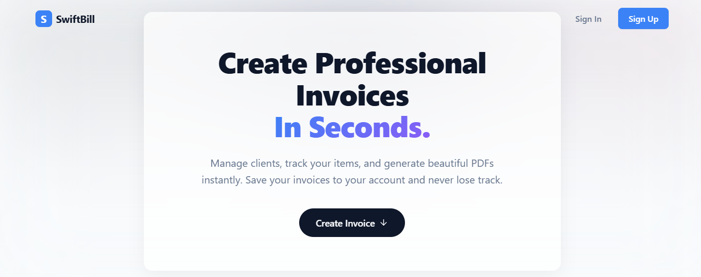
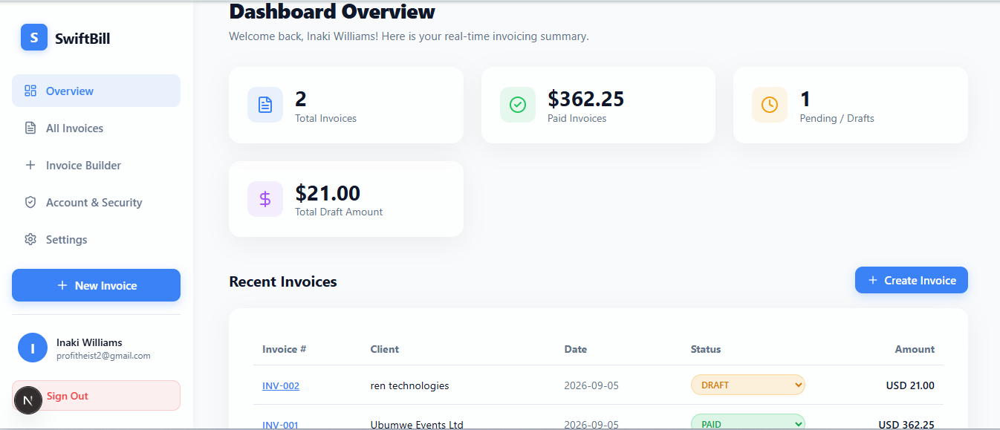
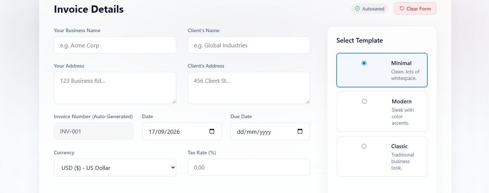
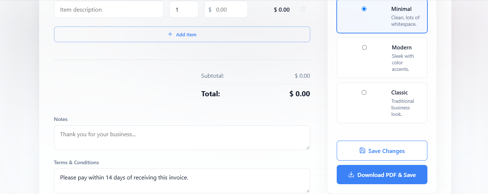
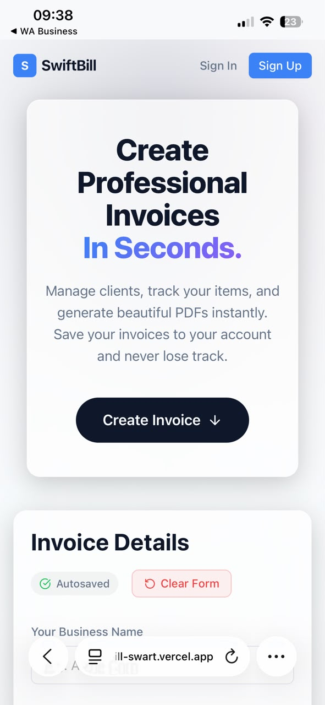
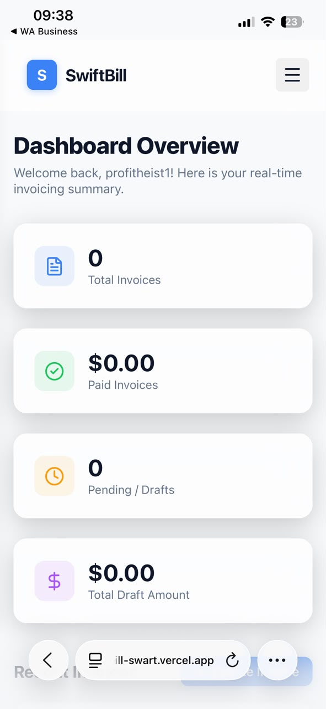
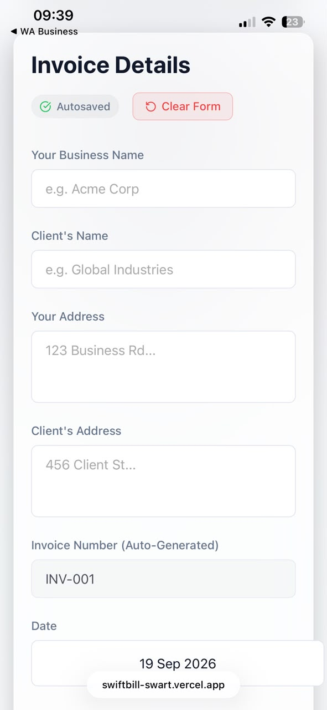

# SwiftBill

> **Create Professional Invoices in Seconds.**

SwiftBill is a minimal, blazing-fast web application designed for freelancers and small businesses to effortlessly create, track, and manage invoices.

It removes the unnecessary complexity of traditional accounting software and provides a frictionless workflow from guest invoice creation to professional PDF generation.

---

## 🔗 Live Demo

**[View Live Application](https://swiftbill-swart.vercel.app/)**


---

## 📸 Screenshots

### 💻 Desktop Views



<br>



<br>



<br>



<br>

### 📱 Mobile Views

<p align="center">
  
  &nbsp;&nbsp;&nbsp;
  
  &nbsp;&nbsp;&nbsp;
  
</p>

---

## 🛠 Tech Stack

| Technology           | Purpose                                         |
| -------------------- | ----------------------------------------------- |
| **Next.js 15**       | Full-stack React framework using the App Router |
| **TypeScript**       | Type-safe application development               |
| **Tailwind CSS**     | Utility-first styling                           |
| **CSS Modules**      | Component-level styling                         |
| **PostgreSQL**       | Relational database                             |
| **Supabase**         | Database and storage infrastructure             |
| **Prisma**           | Database ORM                                    |
| **NextAuth.js**      | Authentication and OAuth                        |
| **Supabase Storage** | User avatar storage                             |
| **Zod**              | Schema validation and API payload validation    |
| **Vercel**           | Application deployment                          |

---

## ✨ Key Features

### 🧾 Guest Invoice Builder

Users can start creating invoices immediately without creating an account.

* No sign-up required to begin
* Invoice drafts are automatically saved to `localStorage`
* Users can continue editing their invoice before authentication

### 🔐 Authentication

SwiftBill provides a seamless transition from guest usage to authenticated accounts.

* Email/password authentication
* Google OAuth
* Secure session management
* Protected application routes

### 📊 Dashboard Analytics

The dashboard provides an overview of invoice activity with aggregated statistics for:

* Paid invoices
* Pending invoices
* Draft invoices
* Invoice totals

### 🔄 Robust Invoice CRUD

Complete invoice lifecycle management allows users to:

* Create invoices
* View invoices
* Edit invoices
* Delete invoices
* Track invoice status

Paid invoices are automatically locked to prevent historical financial records from being modified.

### 🔢 Atomic Invoice Numbering

SwiftBill uses database-level transactions to safely generate sequential invoice numbers such as:

```text
INV-001
INV-002
INV-003
```

Transactions help prevent duplicate invoice numbers when multiple operations occur concurrently.

### 🧠 Smart Autocomplete

SwiftBill automatically builds a reusable catalog from previously entered information.

The system can remember:

* Clients
* Client addresses
* Line items
* Previously used rates

This allows frequently used information to be automatically suggested when creating future invoices.

### 📄 Client-Side PDF Generation

Invoices can be converted into professional PDF documents directly in the browser.

SwiftBill includes three invoice templates:

* **Minimal**
* **Modern**
* **Classic**

### 📑 Server-Side Pagination

Invoices are fetched using server-side pagination rather than loading the entire dataset at once.

This keeps dashboard performance efficient as the number of invoices grows.

### 🛡️ Strict API Validation

Protected API routes use Zod schemas to validate incoming payloads.

Invalid or malformed requests are rejected before they reach the application's core business logic.

---

## 🎯 Intentional Project Scope

SwiftBill was deliberately scoped as a focused portfolio project emphasizing **full-stack architecture, frontend development, API design, and relational database proficiency**.

The following features were intentionally excluded from the MVP to keep the application focused:

### 💳 Payment Processing

Payment gateways such as Stripe are not integrated.

Invoices function as financial records rather than active payment collection pages.

### 📧 Direct Email Delivery

SwiftBill does not currently send invoices directly through an SMTP or transactional email service such as SendGrid.

Users can download their generated PDF and send it through their preferred email client.

### 🔁 Recurring Invoices

The application currently focuses on one-off manual invoicing rather than recurring subscriptions or automated billing schedules.

### 👥 Multi-Tenant Roles

SwiftBill is designed around individual business profiles.

There is currently no admin/employee role-based access control (RBAC).

---

## 🚀 Local Development Setup

### 1. Clone the Repository

```bash
git clone https://github.com/MairoPedroIsaac/swiftbill.git
cd swiftbill
```

### 2. Install Dependencies

```bash
npm install
```

### 3. Configure Environment Variables

Create a `.env` file in the root directory of the project.

> **Important:** Never commit your actual `.env` file to GitHub.

```env
# Supabase PostgreSQL
# Port 6543 is used for connection pooling

DATABASE_URL="postgres://[user]:[password]@[host]:6543/[db]?pgbouncer=true"

# Supabase PostgreSQL
# Port 5432 is used for direct database connections and migrations

DIRECT_URL="postgres://[user]:[password]@[host]:5432/[db]"

# NextAuth Configuration

NEXTAUTH_URL="http://localhost:3000"

NEXTAUTH_SECRET="your_generated_secret_here"

# Google OAuth

GOOGLE_CLIENT_ID="your_google_client_id_here"

GOOGLE_CLIENT_SECRET="your_google_client_secret_here"
```

Replace the placeholder values with your actual Supabase and Google OAuth credentials.

### 4. Set Up the Database

Push the Prisma schema to your Supabase PostgreSQL database:

```bash
npx prisma db push
```

If you need to inspect your database using Prisma Studio:

```bash
npx prisma studio
```

### 5. Start the Development Server

```bash
npm run dev
```

The application will be available at:

```text
http://localhost:3000
```

---

## 📁 Project Highlights

SwiftBill demonstrates practical implementation of:

* Modern Next.js App Router architecture
* TypeScript development
* Relational database design
* Prisma ORM
* PostgreSQL
* Authentication and OAuth
* RESTful API development
* Zod schema validation
* Client-side state persistence
* PDF generation
* Server-side pagination
* Transaction-safe database operations
* Responsive UI development

---

## 🔒 Security Notes

For local development and deployment:

* Never commit `.env` files
* Never expose database credentials in client-side code
* Keep OAuth secrets server-side
* Validate API payloads before processing
* Use protected server-side routes for authenticated operations
* Keep production database credentials private

---

## 📌 Project Status

**Current Status:** MVP / Portfolio Project

SwiftBill is actively developed as a demonstration of full-stack engineering capabilities.

Future improvements may include:

* Online payment processing
* Direct invoice email delivery
* Recurring invoices
* Advanced reporting
* Additional invoice templates
* Business profile customization
* Multi-user collaboration

---

## ⚠️ Disclaimer

SwiftBill is a portfolio project created to demonstrate full-stack software engineering capabilities.

It is not intended for commercial production use as-is.
